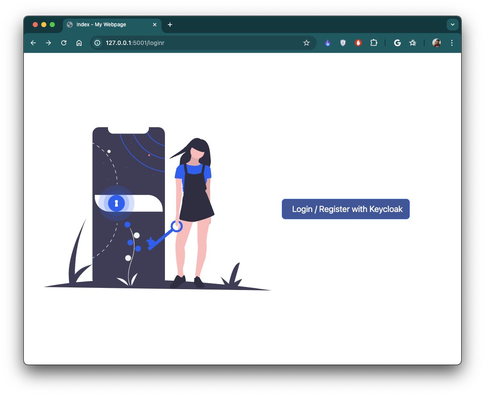
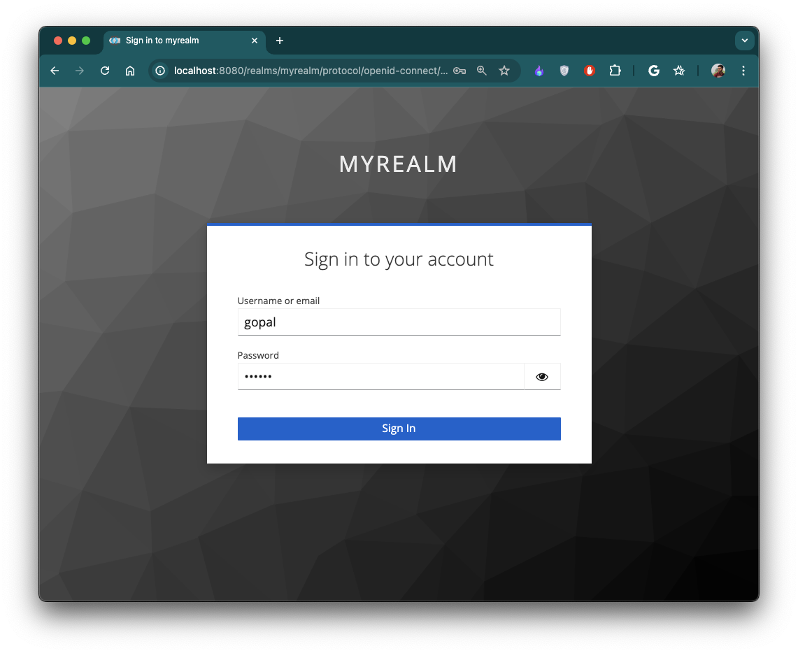
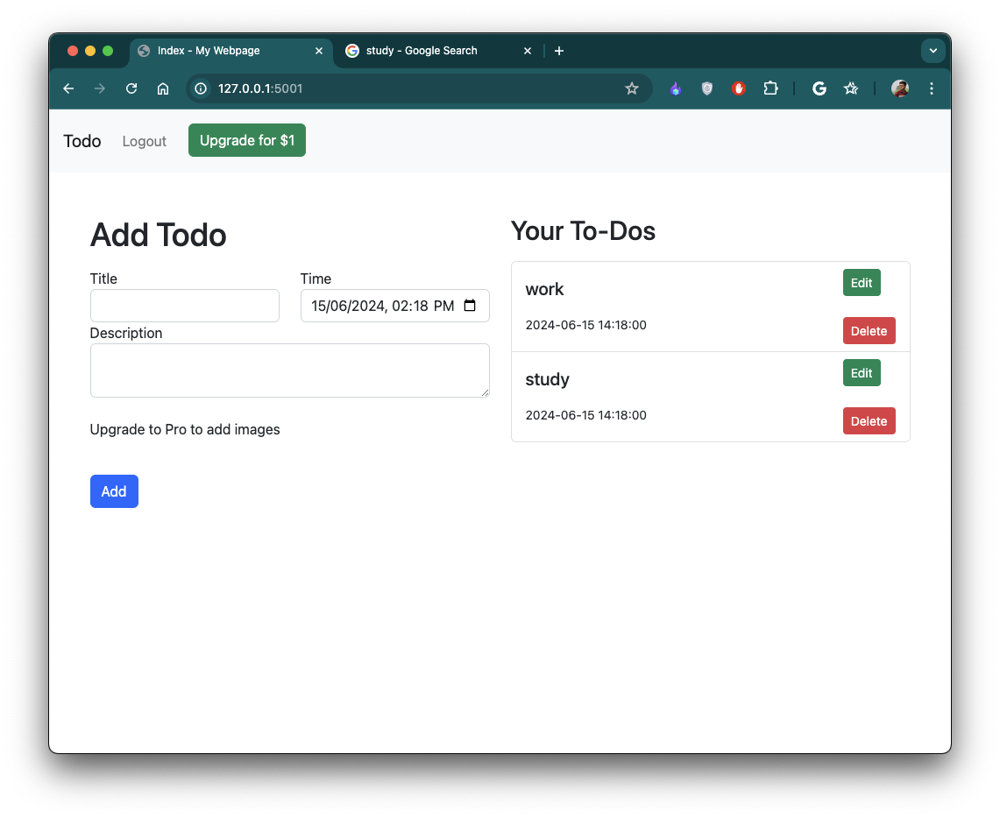
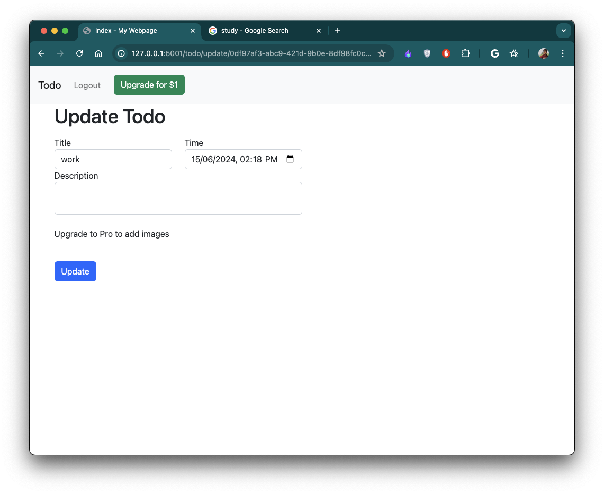

readme_content = """

# To-Do List Web Application

## Project Overview

This is a Flask-based web application designed to manage a to-do list with user authentication, authorization, and
enhanced functionalities for Pro users. The application integrates Keycloak for secure authentication, GraphQL for
handling API requests, and Stripe for managing Pro upgrades.

## Key Features

- **User Authentication and Authorization:** Secure login using Keycloak.
- **GraphQL Integration:** API requests handled through GraphQL, supporting listing, adding, editing, and deleting
  to-dos.
- **To-Do Management:** Each to-do includes a title, description, and timestamp. Pro users can upload images with their
  to-dos.
- **User Interface:** Built with Bootstrap for a modern and responsive design.
- **Stripe Integration:** Handles payments for Pro upgrades in testing mode, unlocking image upload feature for Pro
  users.

## Demo

<div style="display: flex; flex-wrap: wrap; justify-content: space-between;">
    <div style="flex: 0 0 45%; margin-bottom: 20px;">
        
    </div>
    <div style="flex: 0 0 45%; margin-bottom: 20px;">
        
    </div>
    <div style="flex: 0 0 45%; margin-bottom: 20px;">
        
    </div>
    <div style="flex: 0 0 45%; margin-bottom: 20px;">
        
    </div>
</div>

## Installation Instructions

### Prerequisites

- Python 3.x
- Node.js (for Keycloak)
- PostgreSQL (or any other database supported by SQLAlchemy)
- Virtualenv

### Setup Keycloak

1. **Download and Install Keycloak:**
    - Download Keycloak from the [official website](https://www.keycloak.org/downloads).
    - Extract the downloaded file and navigate to the Keycloak directory.
    - Start Keycloak in development mode:
      ```sh
      ./bin/kc.sh start-dev
      ```

2. **Configure Keycloak:**
    - Access Keycloak Admin Console at `http://localhost:8080/auth` and create a new realm.
    - Create a new client in the realm for your Flask application.
    - Set the client’s Access Type to `confidential` and configure the redirect URIs.
    - Create roles and users as needed.

### Setup Flask Application

1. **Clone the Repository:**
   ```sh
   git clone https://github.com/gopalkatariya44/todo_flask_graphql.git
   cd todo_flask_graphql
   ```

2. **Create and Activate a Virtual Environment:**
    ```sh
    python3 -m venv venv
    source venv/bin/activate
    ```

3. **Install Dependencies:**
    ```sh
    pip install -r requirements.txt
    ```
4. **Set Up Environment Variables:**
   Create a `.env` file in the project root with the following variables:
   ```env
   FLASK_APP=app.py
   FLASK_ENV=development
   SECRET_KEY=<your-secret-key>
   OAUTH2_CLIENT_ID=<your-client-id>
   OAUTH2_CLIENT_SECRET=<your-client-secret>
   OAUTH2_ISSUER_URL=<keycloak-issuer-url>
   STRIPE_SECRET_KEY=<your-stripe-secret-key>
    ```

5. **Initialize the Database:**
   ```sh
   flask db init
   flask db migrate
   flask db upgrade

6. **Run the Application:**
   ```sh
   flask run

### Access the Application

- Open your web browser and navigate to `http://localhost:5000`.
- Log in with your Keycloak credentials.
- Manage your to-dos, and upgrade to Pro to unlock additional features.

## Conclusion

This project demonstrates a secure, feature-rich to-do list application with authentication, GraphQL API, and payment
processing. It offers a solid foundation for further enhancements and scalability.

For more details on usage and further customization, please refer to the project documentation.
